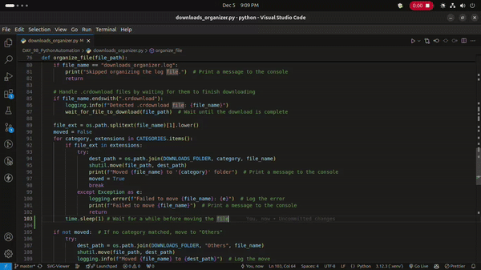

# Downloads Organizer
The **Downloads Organizer** is a Python-based automation tool that keeps your Downloads folder neat and organized. By categorizing files into subfolders (e.g., PDFs, Images, Videos, Documents, etc.) and automating the sorting process in real-time, this script saves time and eliminates clutter.

Powered by the `watchdog` library, the Downloads Organizer monitors your Downloads folder and sorts new files automatically, ensuring everything is always in the right place.

---

## 🌟 Features
- **Real-Time Monitoring**: Automatically detects new files in the Downloads folder.
- **Smart Categorization**: Sorts files into predefined categories (e.g., PDFs, Images, Videos, Documents, etc.).
- **Error Handling**: Logs errors for any failed file movements.
- **Customizable**: Easily add or modify file categories and extensions.
- **Detailed Logging**: Maintains a log file (`downloads_organizer.log`) in the Downloads folder to track all file movements and events.

---

## 🎥 Demo


---

## 🛠️ Setup and Installation

### Prerequisites
- **Python 3.7+** installed on your system.
- Install the required Python packages using pip.

### Installation Steps
1. **Clone this repository**:
   ```bash
   git clone git@github.com:KushalRegmi61/DownloadFile-Organizer.git
   cd DownloadFile-Organizer
   ```

2. **Install dependencies**:
   ```bash
   pip install -r requirements.txt
   ```

3. **Run the script**:
   ```bash
   python downloads_organizer.py
   ```

4. **Add files to your Downloads folder** and watch them get organized automatically.

---

## ⚙️ Configuration
### Adding/Editing Categories
To customize file categories, edit the `CATEGORIES` dictionary in the script:

```python
CATEGORIES = {
    "PDFs": [".pdf"],
    "Images": [".jpg", ".jpeg", ".png", ".gif"],
    "Videos": [".mp4", ".mkv", ".mov"],
    "Documents": [".docx", ".txt", ".xlsx"],
    "Executables": [".exe", ".msi", ".dmg"],
    "Others": []
}
```
- Add new categories or file extensions as needed.

---

## 📝 Logging
The script generates a log file named `downloads_organizer.log` in your Downloads folder. This file keeps a record of all actions, including file movements and errors.

### Sample Log
```
2024-12-05 12:00:01 - INFO - Starting Downloads Organizer script...
2024-12-05 12:00:02 - INFO - Created folder: /home/user/Downloads/PDFs
2024-12-05 12:00:05 - INFO - Started monitoring /home/user/Downloads
2024-12-05 12:01:10 - INFO - Detected new file: /home/user/Downloads/example.pdf
2024-12-05 12:01:11 - INFO - Moved example.pdf to /home/user/Downloads/PDFs/example.pdf
```

---

## 🛠️ Technologies Used
- **Python**: Programming language
- **Watchdog**: Real-time file system monitoring library
- **Shutil**: File operations and management
- **Logging**: Built-in Python library for logging events

---

## 🚀 Future Enhancements
- Add support for more file types and categories.
- Implement a GUI for user-friendly interaction.
- Provide support for monitoring multiple folders.

---

## 🤝 Contribution
Contributions are welcome! If you have ideas for improving this project, feel free to:
- Fork the repository
- Create a feature branch
- Submit a pull request

---

## 📄 License
This project is licensed under the [MIT License](LICENSE).

---

## 👨‍💻 Author
Developed by [Kushal](https://github.com/KushalRegmi61).

---

## 🙏 Acknowledgements
- Thanks to the creators of the `watchdog` library for making real-time monitoring seamless.
- Inspired by the idea of simplifying repetitive tasks through automation.

